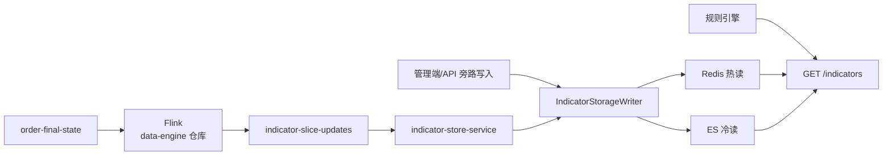

# risk-decision-services

**风控实时决策平台 · Java 微服务后端**

本仓库包含风控实时决策平台（Risk Decision Platform）的全部 **Java 后端微服务**，实现事件接入、规则配置、规则/决策引擎、指标读写、名称筛查、商户评级及管理 BFF 等核心能力。


## 平台架构

### 实时决策链路

```
业务系统 ──REST──▶ 决策网关 ──▶ 规则/决策引擎 ──▶ 返回最终决策
                      │              │
                      │              ├── 规则配置服务（读规则/指标定义）
                      │              ├── 指标存储服务（GET /indicators）
                      │              ├── 筛查服务（名单匹配）
                      │              └── 商户评级服务
                      └── 异步订单落库（MySQL）

管理控制台 ──▶ Admin BFF ──▶ 聚合各服务 API + AI 训练服务
```

### 旁路指标累计链路

Flink 计算与存储解耦：数据引擎输出 Kafka 事件，本仓库 **indicator-store-service** 消费并写入 Redis / ES。



详细设计文档：[docs/architecture-indicator-pipeline.md](./docs/architecture-indicator-pipeline.md)

## 微服务一览

| 服务 | 端口 | 职责 |
|------|-----:|------|
| **admin-bff** | 8080 | 管理端 BFF，聚合后端 API、JWT 鉴权、页面级接口 |
| **decision-gateway** | 8081 | 业务入口：接收风控事件、编排引擎与筛查、返回决策、触发落库 |
| **rule-config-service** | 8082 | 配置中心：事件类型、规则、指标定义、决策优先级；**JWT 签发** |
| **rule-decision-engine** | 8083 | 规则引擎 + 决策引擎：选择器匹配、Aviator 执行、决策聚合 |
| **indicator-store-service** | 8084 | 指标读写：消费切片增量 Kafka、Redis/ES 双写、Redis 优先读取 |
| **screening-service** | 8085 | 名称筛查：观察名单/制裁名单相似度匹配 |
| **merchant-rating-service** | 8086 | 商户风险评级：确定性评分与五档等级映射 |

## 技术栈

- **Java 17** + **Spring Boot 3.3**
- **DDD 四层**：`adapter` / `application` / `domain` / `infrastructure`
- **MyBatis-Plus** + **Flyway**（MySQL）
- **Redis**、**Kafka**、**Elasticsearch**
- **Aviator** 规则表达式引擎
- **Spring Security + JWT** 鉴权
- **Resilience4j** 熔断/重试
- **springdoc-openapi** + **Micrometer/Prometheus** 可观测性

## 集成模式

通过环境变量 `RDP_INTEGRATION_MODE` 切换：

| 模式 | 说明 |
|------|------|
| `standalone`（默认，本地开发） | 各服务内嵌依赖逻辑，单进程可跑通 |
| `remote` | 服务间 HTTP 调用，适合生产多实例部署 |

## 前置依赖

### 1. 公共库

先构建并安装 [risk-decision-commons](https://github.com/snhwade/risk-decision-commons)：

```powershell
git clone https://github.com/snhwade/risk-decision-commons.git
cd risk-decision-commons
mvn install -DskipTests
```

### 2. 基础设施（本地开发）

| 组件 | 默认地址 |
|------|----------|
| MySQL | `localhost:3306`，库名 `risk_decision_platform` |
| Redis | `localhost:6379` |
| Kafka | `localhost:9092` |
| Elasticsearch | `localhost:9200`（指标 ES 回退，可选） |

## 构建与启动

```powershell
git clone https://github.com/snhwade/risk-decision-services.git
cd risk-decision-services
mvn clean install -DskipTests
```

**推荐启动顺序**（standalone 模式）：

1. `rule-config-service`（8082）— 初始化数据库 Schema 与种子数据
2. `indicator-store-service`（8084）
3. `rule-decision-engine`（8083）
4. `screening-service`（8085）
5. `merchant-rating-service`（8086）
6. `decision-gateway`（8081）
7. `admin-bff`（8080）

各模块启动类位于 `*/src/main/java/**/Application.java`，或通过 `mvn spring-boot:run -pl <module>` 启动。

## 集成测试

```powershell
powershell -File scripts/run-java-integration-tests.ps1
```

覆盖 gateway、BFF、screening、indicator-store、merchant-rating 等模块（需本地 MySQL/Redis）。

## API 文档

各服务启动后访问 Swagger UI：

- BFF：`http://localhost:8080/swagger-ui.html`
- 网关：`http://localhost:8081/swagger-ui.html`
- 规则配置：`http://localhost:8082/swagger-ui.html`
- （其他服务同理，端口见上表）

## 目录结构

```
├── admin-bff/                 # 管理 BFF
├── decision-gateway/          # 决策网关
├── rule-config-service/       # 规则配置
├── rule-decision-engine/      # 规则+决策引擎
├── indicator-store-service/   # 指标存储
├── screening-service/         # 名称筛查
├── merchant-rating-service/   # 商户评级
├── docs/                      # 设计/需求文档
├── scripts/                   # 启动、测试、部署脚本
└── deploy/                    # 部署配置
```

## 关联仓库

| 仓库 | 说明 |
|------|------|
| [risk-decision-commons](https://github.com/snhwade/risk-decision-commons) | 公共 Java 库（**必须先 install**） |
| [risk-decision-data-engine](https://github.com/snhwade/risk-decision-data-engine) | 数据引擎（Flink 指标累计 → Kafka 切片增量） |
| [risk-decision-admin-console](https://github.com/snhwade/risk-decision-admin-console) | 管理控制台前端 |
| [risk-decision-ai-training](https://github.com/snhwade/risk-decision-ai-training) | AI 训练与在线评分（端口 8000） |

## 核心业务流程

1. **事中决策**：业务系统 POST 风控事件 → 网关校验 → 引擎匹配规则组 → 执行 Aviator 规则 → 按优先级聚合决策 → 同步返回 PASS/REJECT/REVIEW
2. **旁路指标**：订单终态 → Kafka → Flink 计算 → `indicator-slice-updates` → indicator-store 消费 → Redis/ES → 引擎 `GET /indicators` 读取
3. **管理配置**：Admin Console → BFF → 规则/指标/名单/决策流 CRUD → Kafka 广播配置变更

## 架构文档

| 文档 | 说明 |
|------|------|
| [docs/architecture-indicator-pipeline.md](./docs/architecture-indicator-pipeline.md) | 指标累计全链路（Flink → Kafka → 多路存储） |
| [docs/design.md](./docs/design.md) | 平台总体设计 |
| [docs/requirements.md](./docs/requirements.md) | 需求规格 |
| [docs/README.md](./docs/README.md) | 文档索引 |
