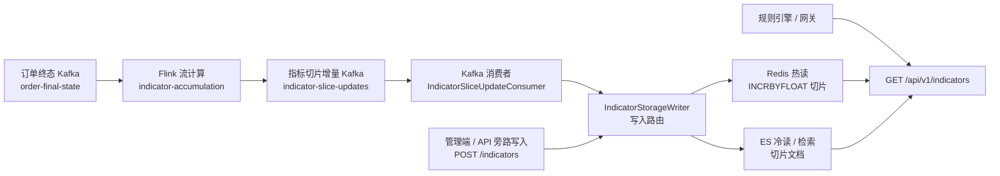
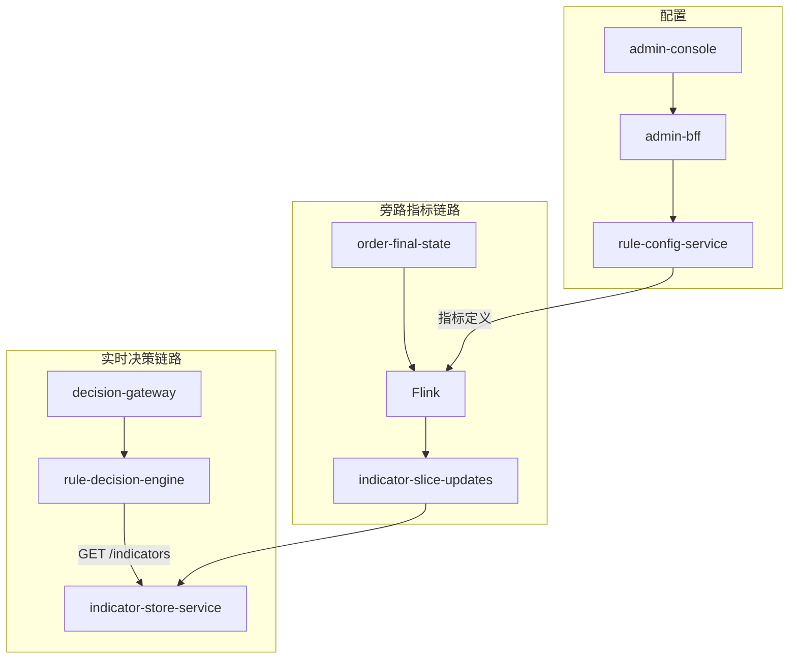

# 指标累计链路架构（Indicator Pipeline）

本文档说明风控实时决策平台 **旁路指标累计** 的设计与实现，帮助读者快速理解「订单终态 → Flink → Kafka → 存储 → 规则读取」全链路。

> 关联需求：R8（Flink + Kafka 累计）、R9（Redis / ES 双存储）  
> 实现仓库：[risk-decision-data-engine](https://github.com/snhwade/risk-decision-data-engine)（Flink）+ [risk-decision-services](https://github.com/snhwade/risk-decision-services)（indicator-store-service）

---

## 1. 为什么这样设计

| 目标 | 方案 |
|------|------|
| 计算与存储解耦 | Flink **只负责流式计算**，结果回写 Kafka，不直连 Redis/ES |
| 多路落库 | 同一 topic 可被多个 consumer group 订阅，分别写 Redis、ES 或未来其他存储 |
| 不阻塞事中决策 | 全链路异步旁路，规则引擎通过 `GET /indicators` 读已落库数据 |
| 低延迟读 + 可检索 | Redis 热读（窗口内切片求和），ES 冷读/检索回退 |

---

## 2. 默认形态（`mode=flink`）



### 数据流逐步说明

1. **业务系统**在订单处理完成后，向 Kafka 主题 `order-final-state` 推送 JSON 格式的订单终态（`OrderFinalState`）。
2. **Flink 作业**（`IndicatorAccumulationJob`）消费该主题：
   - 反序列化 + 校验；
   - 从 rule-config-service 周期性拉取 **ONLINE** 指标定义；
   - 按事件类型与维度字段路由到适用指标；
   - `keyBy(refName | dimensionKey)` 分区，在算子内对 `orderId` 幂等去重；
   - 用 Aviator 累计脚本计算 **本条数据的增量**（increment）；
   - 将 `IndicatorSliceUpdate` 事件写入 Kafka 主题 **`indicator-slice-updates`**。
3. **indicator-store-service**（默认 `indicator.accumulate.mode=flink`）消费 `indicator-slice-updates`：
   - 解析 JSON → `IndicatorSliceUpdate`；
   - 调用 `IndicatorStorageWriter.applySliceIncrement()`；
   - 按配置写入 Redis（`INCRBYFLOAT`）和/或 ES（读-改-写增量）。
4. **规则引擎**在事中决策时调用 `GET /api/v1/indicators/{refName}`：
   - 优先 Redis 窗口内切片求和；
   - Redis 缺失或不可用时回退 ES；
   - 均不可读时返回 `missing=true` 与默认值。

### 旁路写入（不经过 Kafka 消费者）

管理端、AI 训练服务或运维脚本可通过 **REST 直写** 指标值（如 `POST /api/v1/indicators/{refName}`），直接进入 `IndicatorStorageWriter`，与 Kafka 消费路径**并行**，最终都落到 Redis / ES。

---

## 3. Kafka 主题与消息契约

| 主题 | 方向 | 说明 |
|------|------|------|
| `order-final-state` | 生产：业务系统；消费：Flink | 订单终态原始事件 |
| `indicator-slice-updates` | 生产：Flink；消费：indicator-store 等 | 切片增量事件 |

**`IndicatorSliceUpdate` 字段**（定义于 `commons-core`）：

| 字段 | 说明 |
|------|------|
| `refName` | 指标引用名 |
| `dimensionKey` | 维度键，如 `merchant#M001` |
| `granularity` | 切片粒度：`MINUTE` / `HOUR` / `DAY` |
| `sliceTs` | 切片起点 epoch 秒 |
| `increment` | 本条订单对该切片的增量贡献 |
| `orderId` | 订单号（溯源 / ES 审计） |
| `sliceKey` | Redis 键，如 `ind:txn_cnt:M001:DAY:1704067200` |
| `ttlSeconds` | 窗口老化 TTL |

分区键：`refName|dimensionKey`，保证同维度事件有序。

---

## 4. 存储语义

### Redis（热读）

- Key：`ind:{refName}:{dimensionKey}:{granularity}:{sliceTs}`
- 写入：`INCRBYFLOAT` + `EXPIRE`（增量语义，与 Flink 下发一致）
- 读取：对窗口内多个切片 `MGET` 后求和

### Elasticsearch（冷读 / 检索）

- 文档 id：`{refName}:{dimensionKey}:{sliceTs}`
- 写入：消费端读当前值 + increment 后 upsert
- 读取：按 refName + dimensionKey + sliceTs 范围聚合

### 读写开关

通过 `indicator.storage.*` 独立控制：

```yaml
indicator.storage.write-redis: true   # 消费时写 Redis
indicator.storage.write-es: true      # 消费时写 ES
indicator.storage.read-redis: true    # GET 时优先 Redis
indicator.storage.read-es: true       # GET 时 ES 回退
```

---

## 5. 多路消费（扩展其他存储）

同一 `indicator-slice-updates` 可被多个 consumer group 订阅，各自决定写哪里：

```yaml
# 实例 A：只写 Redis
indicator.storage.write-redis: true
indicator.storage.write-es: false
indicator.accumulate.slice-group: indicator-writer-redis

# 实例 B：只写 ES
indicator.storage.write-redis: false
indicator.storage.write-es: true
indicator.accumulate.slice-group: indicator-writer-es
```

未来新增 ClickHouse、对象存储等，只需新增独立消费者，**无需改动 Flink 作业**。

---

## 6. 降级形态（`mode=service`）

开发或 Flink 不可用时可切换：

```yaml
indicator.accumulate.mode: service
```

```
order-final-state → indicator-store @KafkaListener → 应用内累计 → Redis/ES
```

跳过 Flink 与 `indicator-slice-updates`，由 `IndicatorAccumulateService` 在进程内完成路由与累计（读-改-写语义）。**生产默认仍推荐 `flink` 模式。**

---

## 7. 配置速查

### Flink 作业

| 参数 / 环境变量 | 默认 | 说明 |
|-----------------|------|------|
| `--kafka` / `KAFKA_BOOTSTRAP` | `localhost:9092` | Kafka 地址 |
| `--sink-topic` / `INDICATOR_SLICE_TOPIC` | `indicator-slice-updates` | 输出主题 |
| `--rule-config` / `RULE_CONFIG_URL` | `http://localhost:8082` | 指标定义来源 |
| `--group` | `indicator-accumulation` | 源 topic 消费组 |

### indicator-store-service

| 配置 | 默认 | 说明 |
|------|------|------|
| `indicator.accumulate.mode` | `flink` | `flink` / `service` |
| `indicator.accumulate.slice-topic` | `indicator-slice-updates` | 切片增量主题 |
| `indicator.accumulate.slice-group` | `indicator-slice-writer` | 消费组 |

### 运行时自检

```http
GET http://localhost:8084/api/v1/accumulate/runtime
```

返回当前模式、topic、消费组与 pipeline 文字描述。

---

## 8. 关键代码入口

| 组件 | 类 / 路径 |
|------|-----------|
| Flink 作业入口 | `indicator-accumulation/.../IndicatorAccumulationJob.java` |
| 累计 + 下发 | `IndicatorAccumulateEmitFunction` |
| Kafka 序列化 | `IndicatorSliceUpdateKafkaSerializer` |
| 事件契约 | `commons-core/.../IndicatorSliceUpdate.java` |
| Kafka 消费 | `indicator-store-service/.../IndicatorSliceUpdateConsumer.java` |
| 写入路由 | `IndicatorStorageWriter.applySliceIncrement()` |
| 指标读取 | `IndicatorReadService` + `IndicatorController` |

---

## 9. 与平台其他链路的关系



- **实时决策**与 **指标累计** 在运行时解耦；引擎只读 store，不等待 Flink。
- 指标定义在 rule-config 维护，Flink 与 store 均周期性同步 ONLINE 定义。

---

## 10. 监控建议

| 观测点 | 说明 |
|--------|------|
| Flink Web UI | 背压、Checkpoint、算子延迟 |
| Kafka lag | `order-final-state`（Flink 消费）、`indicator-slice-updates`（store 消费） |
| Redis | 内存、key 数量、`ind:*` 增长 |
| ES | 写入失败告警、索引延迟 |
| `/accumulate/runtime` | 确认当前走 flink 还是 service 模式 |
