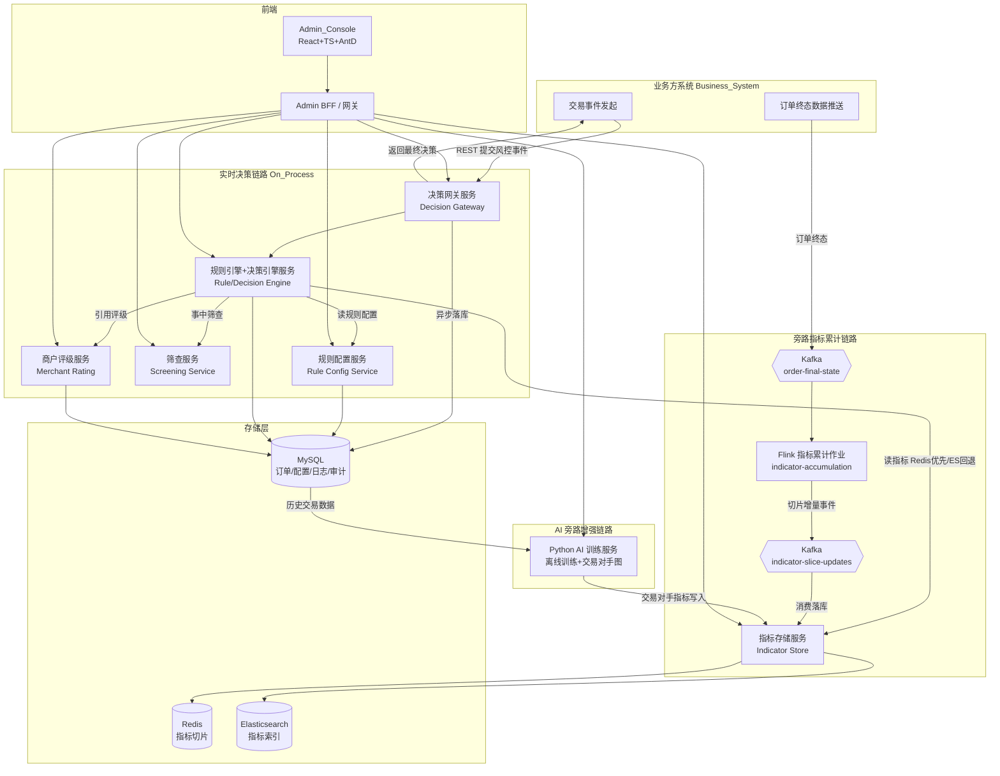
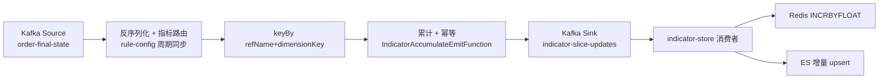
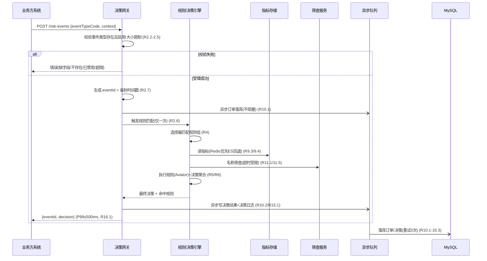
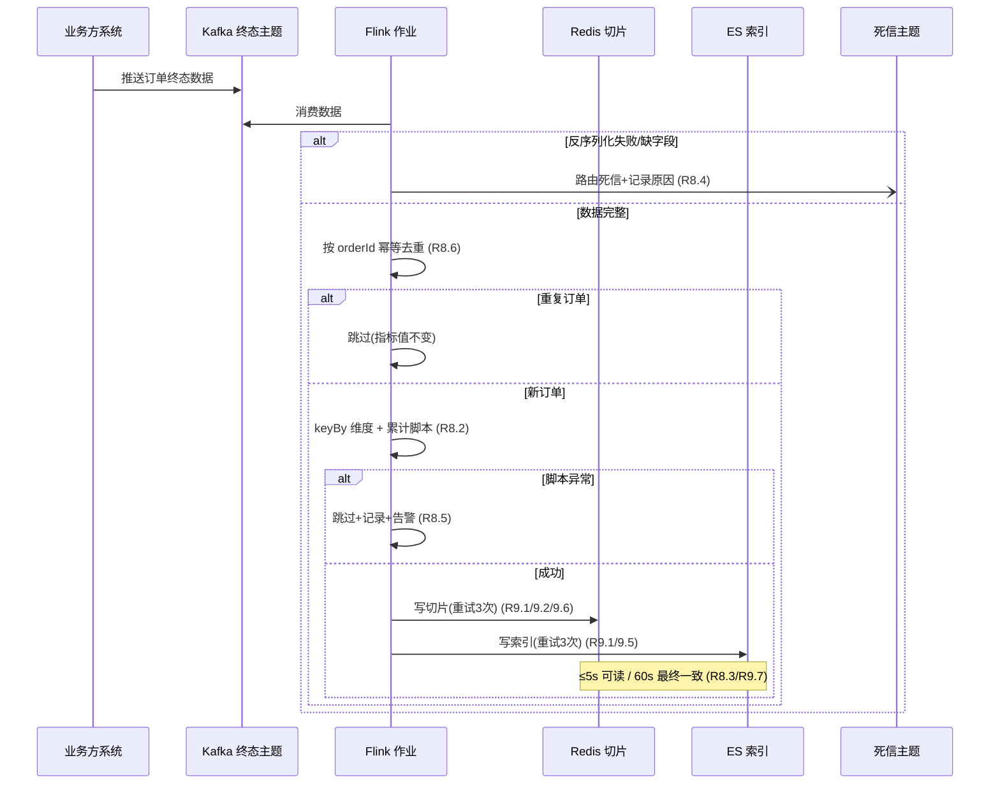
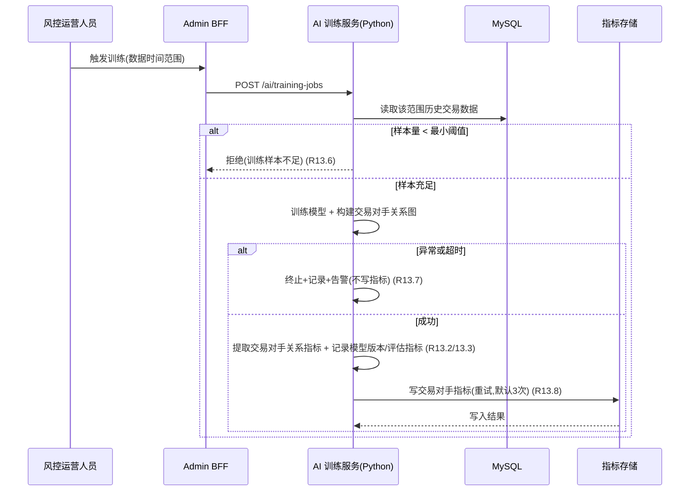

# 设计文档：风控实时决策平台（Risk Decision Platform）

## Overview

概述

本设计文档面向"风控实时决策平台"，一套全新、独立、完全基于开源技术栈的实时风控决策系统。设计严格落实需求文档中确认的 17 条需求，并遵循业务方明确的技术与架构约束。

核心链路为：**事件接入 → 规则选择器匹配规则组 → 规则引擎执行规则 → 决策引擎按优先级聚合 → 返回最终决策 + 订单落库**。围绕该主链路，平台提供旁路指标累计链路（Kafka → Flink → Kafka → Redis/ES）与 AI 旁路增强链路。指标链路详见 [architecture-indicator-pipeline.md](./architecture-indicator-pipeline.md)。

### 设计目标与关键决策

| 决策点 | 选择 | 理由 | 关联需求 |
| --- | --- | --- | --- |
| 后端框架 | Spring Boot 3 + Java 21 | 主流开源、虚拟线程（Loom）利于高并发低延迟事中链路 | R14, R16 |
| 架构方法 | DDD 分层（adapter/application/domain/infrastructure）+ 限界上下文微服务化 | 满足"DDD + 可拆分多服务"约束 | R14.2 |
| 规则表达式引擎 | 开源 Aviator（`com.googlecode.aviator`） | 轻量、可编译缓存表达式、支持自定义函数与变量、纯 JVM | R3, R5 |
| 流计算 | Apache Flink | 有状态流处理、窗口、exactly-once、keyBy 维度累计 | R8 |
| 消息 | Apache Kafka | 业务方推送订单终态数据的标准通道、支持死信主题 | R8 |
| 指标存储 | Redis 切片（优先读） + Elasticsearch（回退/检索） | 兼顾低延迟与可检索分析，双写双实现 | R9 |
| 关系库 | MySQL + MyBatis-Plus | 事中订单、配置、决策日志、审计落库 | R10, R15, R17 |
| 鉴权 | Spring Security + JWT | 无状态鉴权，利于水平扩展 | R17 |
| API 文档 | springdoc-openapi | OpenAPI 3 自动生成 | R14 |
| 可观测性 | Micrometer + Prometheus + Grafana + Micrometer Tracing/OpenTelemetry | 指标、链路追踪开源标准 | R15 |
| 前端 | React + TypeScript + Ant Design（单一工程 Admin_Console） | 满足"前端统一收敛单一工程" | R14.1 |
| AI 训练 | Python 旁路服务（离线训练 + 交易对手关系图） | 增强能力，不强依赖实时链路 | R13 |

### 开源依赖约束（R14.3, R14.4）

- 所有服务的依赖坐标必须来源于公共开源仓库（Maven Central / PyPI / npm 公共 registry）。
- **禁止** 任何私有仓库依赖，特别是 `com.xgd.crossborder.commons.*` 系列。鉴权、消息、会话等能力一律采用开源替代（Spring Security、Spring Kafka、Spring Session 等），不复用私有 commons。
- 构建管线（Maven Enforcer Plugin `bannedDependencies` 规则 + CI 校验）将对禁用坐标进行拦截，命中即构建失败并报告坐标。

---

## Architecture

总体架构

### 架构总览图



### 三条链路说明

1. **实时决策链路（事中，R2/R5/R6/R10/R11/R16）**：业务方系统经决策网关提交风控事件 → 网关校验受理并编排 → 规则选择器选规则组 → 规则引擎执行 → 决策引擎聚合 → 同步返回最终决策；订单数据异步落库 MySQL，不阻塞返回（P99 ≤ 500ms）。
2. **旁路指标累计链路（R8/R9）**：业务方推送订单终态至 Kafka → Flink 计算切片增量 → 回写 Kafka（`indicator-slice-updates`）→ indicator-store 等消费者写入 Redis / ES → 规则引擎读取（Redis 优先、ES 回退）。详见 [architecture-indicator-pipeline.md](./architecture-indicator-pipeline.md)。
3. **AI 旁路增强链路（R13）**：Python 训练服务读取 MySQL 历史交易订单数据 → 离线训练模型 + 构建交易对手关系图 → 提取交易对手关系指标写入指标存储 → 规则可引用该类指标。该链路为增强能力，禁用时不影响核心功能。

---

## 限界上下文与微服务拆分（DDD）

后端按限界上下文（Bounded Context）拆分为多个独立可部署服务。各服务内部统一采用 DDD 四层结构：

- **adapter**：入站/出站适配器（REST Controller、Kafka Consumer/Producer、Repository 实现）。
- **application**：应用服务、编排、事务边界、DTO 装配。
- **domain**：聚合根、实体、值对象、领域服务、领域事件（纯业务逻辑，不依赖框架）。
- **infrastructure**：持久化、外部存储、消息、缓存的技术实现。

### 服务清单与职责映射

| 服务 | 限界上下文 | 核心职责 | 主要聚合根 | 通信方式 | 覆盖需求 |
| --- | --- | --- | --- | --- | --- |
| **决策网关服务**（Decision Gateway） | 事件接入与编排 | 接收/校验/受理风控事件、编排规则引擎与筛查、返回最终决策、触发订单落库 | RiskEvent（风控事件） | 入站 REST（业务方）；出站 REST（引擎/筛查）；异步落库 | R2, R10.1, R16.1 |
| **规则配置服务**（Rule Config Service） | 规则与配置管理 | 事件类型、规则、规则组、选择器、指标定义、决策优先级配置的 CRUD 与校验 | EventType / Rule / RuleGroup / RuleSelector / IndicatorDefinition | 入站 REST（BFF） | R1, R3, R4, R6.9-6.10, R7 |
| **规则引擎+决策引擎服务**（Rule/Decision Engine） | 风控判定 | 选择器匹配、规则执行（Aviator）、决策聚合、决策日志、执行链路记录 | DecisionContext（决策上下文）、Decision（决策） | 入站 REST（网关/BFF）；读 RuleConfig（缓存）、IndicatorStore | R4, R5, R6, R15.1/3 |
| **指标流计算作业**（Flink Stream Compute） | 指标累计 | 消费 Kafka 终态、计算切片增量、回写 Kafka `indicator-slice-updates`；幂等、窗口老化 | IndicatorSliceUpdate | Kafka 消费 + Kafka 生产 | R8 |
| **指标存储服务**（Indicator Store） | 指标读写 | 消费切片增量 Kafka、双写 Redis/ES、读路由、旁路 REST 写入 | IndicatorValue | Kafka 消费；入站 REST（引擎/AI/管理端） | R9, R16.2/3 |
| **筛查服务**（Screening Service） | 名单筛查 | 名单/制裁/道琼斯名称筛查、相似度阈值匹配、超时/失败处置信号 | ScreeningList / ScreeningResult | 入站 REST（网关/BFF） | R11 |
| **商户评级服务**（Merchant Rating Service） | 商户风险评级 | 评分计算（确定性）、五档等级映射、评级持久化、供规则引用 | MerchantRating（商户评级） | 入站 REST（BFF/引擎） | R12 |
| **AI 训练服务**（Python AI Training） | AI 增强 | 历史数据训练、交易对手关系图、交易对手指标提取写入指标存储 | TrainingJob / CounterpartyGraph | 读 MySQL；写 IndicatorStore；入站 REST（BFF） | R13 |
| **Admin BFF / 网关** | 前端聚合 | 聚合各后端服务、统一鉴权（JWT）、为 Admin_Console 提供页面级聚合接口 | 无（无状态聚合层） | 入站 REST（前端）；出站 REST（各服务） | R14, R17 |

> 说明：规则引擎与决策引擎在本设计中合并为同一服务（强同步、低延迟、共享决策上下文），符合需求中"决策引擎可与规则引擎同服务或独立"的弹性。后续如需独立扩展可沿 `domain` 边界拆分。

### 服务间依赖与通信原则

- **同步 REST**：事中链路对延迟敏感，决策网关 → 规则/决策引擎 → 指标存储/筛查/评级均为同步调用，超时受决策时限（默认 500ms）约束。
- **异步 Kafka**：订单终态数据累计（业务方 → Kafka → Flink）、订单落库可走异步队列以不阻塞决策返回。
- **本地缓存**：规则/决策引擎对规则配置、指标定义、决策优先级使用本地缓存（带版本号/失效推送），规则启用/禁用 5 秒内生效（R3.4/R3.9）。
- **配置变更传播**：规则配置服务在配置变更时通过 Kafka 配置变更主题广播失效消息，引擎服务订阅后刷新本地缓存。

---

## Components and Interfaces

核心组件与接口

### 1. 规则模型（Rule Model，R3/R4/R5/R6）

```
EventType（事件类型）
  - id, code(唯一), name, status(ENABLED/DISABLED)

Rule（规则）
  - id, eventTypeCode, expression(Aviator, 1..4000), version, status, decisionRef
  - referencedFields: Set<String>   // 引用的指标/上下文字段，用于声明校验

RuleGroup（规则组）
  - id, eventTypeCode, status, ruleIds: List<ruleId>

RuleSelector（规则选择器）
  - id, priority(数值越小优先级越高), matchType(SIMPLE_KV | SELECTOR_RULE | FALLBACK)
  - selectKey, selectValue           // SIMPLE_KV 用
  - selectorExpression               // SELECTOR_RULE 用（Aviator）
  - ruleGroupId, status

RuleDecision（规则决策）
  - ruleId, decision(PASS|REVIEW|REJECT|SHORT_CIRCUITED 标记), priority(1..9999)
```

#### 选择器匹配算法（R4.3-4.7, R5.1）

```
function selectRuleGroup(event):
    candidates = enabledSelectors(event.eventTypeCode)
    matched = []
    for s in candidates where s.matchType != FALLBACK:
        if s.matchType == SIMPLE_KV and event.context[s.selectKey] == s.selectValue:
            matched.add(s)
        elif s.matchType == SELECTOR_RULE and evalBool(s.selectorExpression, event.context):
            matched.add(s)
    if matched not empty:
        # 优先级数值最小 = 优先级最高；同优先级取 selectorId 最小，保证确定性 (R4.4, R4.5)
        best = min(matched, key=lambda s: (s.priority, s.id))
        return best.ruleGroupId
    fallback = findFallbackSelector(event.eventTypeCode)   # R4.6
    if fallback exists: return fallback.ruleGroupId
    return NO_MATCH      # R4.7：不产生命中
```

#### 规则执行算法（R5.1-5.6）

```
function executeRuleGroup(group, event):
    results = []
    rules = enabledRules(group) sorted by (priority asc, ruleId asc)   # R5.1 确定顺序
    for rule in rules:
        try:
            hit = evalExpression(rule.expression, event.context, indicatorValues)  # R5.2
            record(rule.id, rule.version, context, hit)                            # R5.5
            if hit:
                results.add(ruleDecision(rule))
                if rule.decision == SHORT_CIRCUITED:    # R5.6 命中短路
                    break                               # 停止执行更低优先级规则
        except EvalException as e:
            try:
                markFailed(rule, e); recordFailure(rule, e)   # R5.3 计未命中，不贡献决策，继续
            except FatalException as fe:
                recordFatal(group, fe)                        # R5.4 致命错误
                group.status = INTERRUPTED                    # 停止剩余规则，保留已有命中
                break
    return results
```

### 2. 决策引擎（Decision Engine，R6）

#### 决策聚合算法（R6.1-6.4, R6.7）

```
STRICTNESS = { REJECT: 3, REVIEW: 2, PASS: 1 }   # 数值越大越严格（R6.3 默认次序）

function aggregate(hitDecisions, config):
    if hitDecisions is empty:
        return PASS                               # R6.4 无命中默认放行
    minPriority = min(d.priority for d in hitDecisions)   # R6.2 取最小优先级数值
    topGroup = [d for d in hitDecisions if d.priority == minPriority]
    # R6.3 同最小优先级，按严格性取最严格
    final = max(topGroup, key=lambda d: STRICTNESS[d.decision])
    return final.decision

# 决策时限（R6.5）：默认 500ms，范围 1..5000ms
# 超时（R6.7）：返回 config.timeoutDisposition 并记录超时原因
```

- 决策聚合在配置时限内（默认 500ms，R6.5）完成；超时按预配置的超时处置策略产出决策并记录原因（R6.7）。
- 决策完成后记录最终决策 + 全部命中规则及各自决策（R6.6），写入 `decision_log`。

### 3. 指标定义与累计脚本模型（R7）

```
IndicatorDefinition（指标定义）
  - id, refName(唯一, 1..64, [A-Za-z0-9_]), dimensions: List<String>
  - windowDays(1..365), sliceGranularity(MINUTE|HOUR|DAY)
  - accScript(Aviator 累计脚本), defaultValueStrategy(缺失默认取值, R16.3)
  - 约束：windowDays 须为 sliceGranularity 的整数倍 (R7.5)
```

### 4. 指标读取（Indicator Store，R9/R16）

```
function readIndicator(refName, dimensionKey):
    try:
        v = redis.readSlicesAndAggregate(refName, dimensionKey)   # R9.3 ≤50ms
        if v present: return v
    except RedisUnavailable: pass
    try:
        return es.read(refName, dimensionKey)        # R9.4 ES 回退
    except EsUnavailable: pass
    return INDICATOR_UNREADABLE                       # R9.4 不可读
    # 调用方（规则引擎）对不可读指标按 defaultValueStrategy 取默认值并记录缺失 (R16.3)
```

### 5. 关键 REST 端点示意

```
# 决策网关（业务方）
POST /api/v1/risk-events                  受理风控事件并返回最终决策 (R2, R6)
  Req:  { eventTypeCode, context: {...} }
  Resp: { eventId, decision, hitRules:[...], elapsedMs }

# 规则配置服务（BFF）
POST   /api/v1/event-types                创建事件类型 (R1.1)
PUT    /api/v1/event-types/{id}/status    启用/禁用 (R1.4)
GET    /api/v1/event-types                列表 (R1.6)
POST   /api/v1/rules                       创建规则 (R3.1)
PUT    /api/v1/rules/{id}                  更新规则(版本+1) (R3.3)
PUT    /api/v1/rules/{id}/status           启用/禁用 (R3.4/3.9)
POST   /api/v1/rule-groups                 创建规则组 (R4.1)
POST   /api/v1/rule-selectors              配置选择器 (R4.10)
POST   /api/v1/indicator-definitions       创建指标定义 (R7.1)
POST   /api/v1/decision-priorities         配置决策优先级与超时处置 (R6.9)

# 指标存储服务
GET    /api/v1/indicators/{refName}        读取指标值（Redis优先ES回退）(R9.3/9.4)

# 筛查服务
POST   /api/v1/screening                   名称筛查 (R11.1)
PUT    /api/v1/screening/threshold         配置相似度阈值 (R11.4)

# 商户评级服务
POST   /api/v1/merchants/{id}/rating       触发评级计算 (R12.1)
GET    /api/v1/merchants/{id}/rating       查看评级 (R12.7)

# 订单查询
GET    /api/v1/orders?merchant=&eventType=&from=&to=&page=  订单分页查询 (R10.4)

# AI 训练服务（Python）
POST   /api/v1/ai/training-jobs            触发训练 (R13.1)
GET    /api/v1/ai/training-jobs            训练任务列表与状态 (R13.10)

# 可观测性
GET    /api/v1/trace/{eventId}             执行链路查询 (R15.3)
GET    /actuator/prometheus                监控指标暴露 (R15.2)
```

---

## Data Models

数据模型

### MySQL 表设计（关键字段）

> 引擎：InnoDB，字符集 utf8mb4。所有表含 `created_at`、`updated_at`、`created_by`、`updated_by`（审计追溯）。敏感字段（交易主体名称等）落库加密（R17.4）。

#### event_type（事件类型，R1）
| 字段 | 类型 | 说明 |
| --- | --- | --- |
| id | BIGINT PK | 自增主键 |
| code | VARCHAR(64) UNIQUE | 唯一 code，[A-Za-z0-9_] |
| name | VARCHAR(100) | 名称 1..100 |
| status | TINYINT | 0=禁用 1=启用 |

#### rule（规则，R3）
| 字段 | 类型 | 说明 |
| --- | --- | --- |
| id | BIGINT PK | |
| event_type_code | VARCHAR(64) IDX | 关联事件类型 |
| expression | TEXT | Aviator 表达式 1..4000 |
| referenced_fields | JSON | 引用字段集合（声明校验 R3.5/3.6） |
| decision | VARCHAR(20) | PASS/REVIEW/REJECT |
| short_circuited | TINYINT | 是否短路 R5.6 |
| version | INT | 版本号，更新+1 R3.3 |
| status | TINYINT | 启用/禁用 |

#### rule_group（规则组，R4）
| 字段 | 类型 | 说明 |
| --- | --- | --- |
| id | BIGINT PK | |
| event_type_code | VARCHAR(64) IDX | |
| status | TINYINT | 启用/禁用 R4.8 |

#### rule_group_rule（规则组-规则关联）
| 字段 | 类型 | 说明 |
| --- | --- | --- |
| group_id | BIGINT | |
| rule_id | BIGINT | |
| priority | INT | 组内规则优先级（数值越小越高 R5.1） |

#### rule_selector（规则选择器，R4）
| 字段 | 类型 | 说明 |
| --- | --- | --- |
| id | BIGINT PK | 唯一标识（同优先级取最小 R4.5） |
| event_type_code | VARCHAR(64) IDX | |
| priority | INT | 选择器优先级 R4.4 |
| match_type | VARCHAR(20) | SIMPLE_KV/SELECTOR_RULE/FALLBACK R4.3/4.6 |
| select_key | VARCHAR(128) | SIMPLE_KV 用 |
| select_value | VARCHAR(256) | SIMPLE_KV 用 |
| selector_expression | TEXT | SELECTOR_RULE 用 |
| rule_group_id | BIGINT | 关联规则组 |
| status | TINYINT | 启用/禁用 |

#### rule_decision / decision_priority_config（决策优先级，R6）
| 字段 | 类型 | 说明 |
| --- | --- | --- |
| rule_id | BIGINT | |
| priority | INT | 1..9999 决策优先级 R6.1/6.10 |
| timeout_ms | INT | 决策时限 1..5000，默认 500 R6.5 |
| timeout_disposition | VARCHAR(20) | 超时处置策略 R6.7 |

#### indicator_definition（指标定义，R7）
| 字段 | 类型 | 说明 |
| --- | --- | --- |
| id | BIGINT PK | |
| ref_name | VARCHAR(64) UNIQUE | 引用名，[A-Za-z0-9_] R7.1/7.3 |
| dimensions | JSON | 统计维度 |
| window_days | INT | 1..365 R7.5 |
| slice_granularity | VARCHAR(10) | MINUTE/HOUR/DAY R7.5 |
| acc_script | TEXT | 累计脚本 Aviator R7.1/7.4 |
| default_value_strategy | VARCHAR(50) | 缺失默认取值 R16.3 |

#### risk_order（事中订单，R10）
| 字段 | 类型 | 说明 |
| --- | --- | --- |
| id | BIGINT PK | |
| event_id | VARCHAR(64) UNIQUE | 事件标识，至多一条记录 R10.1 |
| merchant_id | VARCHAR(64) IDX | 商户（查询过滤 R10.4） |
| event_type_code | VARCHAR(64) IDX | 事件类型（查询过滤） |
| context | JSON/加密 | 事件上下文（敏感加密 R17.4） |
| final_decision | VARCHAR(20) | 最终决策 R10.2 |
| event_time | DATETIME(3) IDX | 受理时间（毫秒，时间范围过滤 R10.4） |

#### decision_log（决策日志，R6/R15）
| 字段 | 类型 | 说明 |
| --- | --- | --- |
| id | BIGINT PK | |
| event_id | VARCHAR(64) IDX | |
| final_decision | VARCHAR(20) | 最终决策 R15.1 |
| hit_rules | JSON | 命中规则及各自决策/优先级 R6.6 |
| elapsed_ms | INT | 处理耗时 R15.1 |
| timeout_reason | VARCHAR(255) | 超时原因（若有）R6.7 |
| group_status | VARCHAR(20) | 规则组执行状态（含 INTERRUPTED R5.4） |

#### merchant_rating（商户评级，R12）
| 字段 | 类型 | 说明 |
| --- | --- | --- |
| merchant_id | VARCHAR(64) PK | |
| score | INT | 0..100 R12.1 |
| level | VARCHAR(10) | LOW/MID_LOW/MID/MID_HIGH/HIGH R12.2 |
| status | VARCHAR(20) | RATED/UNRATED R12.5 |
| factors | JSON | 评级因子快照 |

#### screening_list / screening_result（筛查，R11）
| 字段 | 类型 | 说明 |
| --- | --- | --- |
| id | BIGINT PK | |
| source | VARCHAR(50) | 名单来源（名单/制裁/道琼斯）R11.2 |
| entry_name | VARCHAR(512) | 名单条目（加密） |
| similarity_threshold | DECIMAL(3,2) | 阈值 0.00..1.00 默认 0.85 R11.4 |

#### audit_log（审计日志，R17.3）
| 字段 | 类型 | 说明 |
| --- | --- | --- |
| id | BIGINT PK | |
| operator | VARCHAR(64) | 操作人 |
| op_time | DATETIME(3) | 操作时间 |
| op_type | VARCHAR(20) | CREATE/UPDATE/DELETE |
| target_type | VARCHAR(40) | event_type/rule/rule_group/indicator |
| op_content | JSON | 操作内容 |

#### ai_training_job（AI 训练任务，R13）
| 字段 | 类型 | 说明 |
| --- | --- | --- |
| id | BIGINT PK | |
| data_from / data_to | DATETIME | 数据时间范围 R13.3 |
| status | VARCHAR(20) | RUNNING/SUCCESS/FAILED |
| model_version | VARCHAR(40) | 模型版本 R13.3 |
| metrics | JSON | 评估指标 R13.3 |
| fail_reason | VARCHAR(255) | 失败原因 R13.7/13.11 |

### Redis 指标切片 Key 设计

```
Key 格式:  ind:{refName}:{dimensionKey}:{sliceGranularity}:{sliceTimestamp}
  例:     ind:txn_cnt_7d:merchant#M001:HOUR:2024010110
Value:    切片累计值（Hash 或 String，依累计脚本结果类型）
TTL:      windowDays 对应秒数 + 一个切片宽度的缓冲（自动老化 R8.7）
读取:     按 [now-window, now] 范围扫描所有切片 key 并按累计脚本聚合
窗口老化:  超出窗口的切片 key 因 TTL 过期被淘汰，不参与当前值计算 (R8.7)
幂等去重:  ind:dedup:{orderId} (SET NX EX)，已处理订单不重复累计 (R8.6)
```

### Elasticsearch 指标索引 mapping 要点

```
Index:    indicator-{refName}（或统一 indicator-* + refName 字段）
Mapping:
  refName        keyword
  dimensionKey   keyword
  sliceTs        date            // 切片时间，支持范围聚合
  value          double/long     // 累计值
  orderId        keyword         // 幂等溯源
  updatedAt      date
用途:     Redis 不可用时回退读取（按 dimensionKey + sliceTs 范围聚合）(R9.4)；可检索分析
一致性:   双写，60 秒内最终一致 (R9.7)
```

---

## Flink 作业设计（Stream Compute，R8/R9）

指标累计采用 Apache Flink 流处理作业：从 Kafka 订单终态主题消费，按指标定义累计脚本计算**切片增量**，回写 Kafka 主题 `indicator-slice-updates`。**存储写入由 indicator-store-service 等下游消费者完成**，实现计算与落库解耦、支持多路监听写入不同存储。详见 [architecture-indicator-pipeline.md](./architecture-indicator-pipeline.md)。

### 作业拓扑（当前实现）



### 关键设计点

| 设计点 | 方案 | 关联需求 |
| --- | --- | --- |
| 消费来源 | Kafka Source（`order-final-state`），消费者组隔离、按分区并行 | R8.1 |
| 反序列化 | JSON → `OrderFinalState`；失败记录并丢弃（DLQ 规划） | R8.4 |
| 指标路由 | 匹配 ONLINE 指标定义；缺维度字段则跳过该指标 | R8.2 |
| 幂等去重 | Flink keyed 状态按 `orderId` 去重，同一分区重复订单只下发一次增量 | R8.6 |
| keyBy 维度 | 按 `refName + dimensionKey` 分区 | R8.2 |
| 累计计算 | Aviator `accScript` 在 `current=0` 求值得到 increment；脚本异常跳过 | R8.2, R8.5 |
| 结果下发 | `IndicatorSliceUpdate` JSON 写入 Kafka；分区键 refName\|dimensionKey | R8.3 |
| 存储落库 | indicator-store 消费后 `INCRBYFLOAT`（Redis）/ 读改写（ES） | R8.3, R9.1, R9.2 |
| 窗口老化 | 切片 TTL = 窗口 + 一个切片宽度 | R8.7 |
| 多路扩展 | 不同 consumer group 可分别写 Redis、ES 或未来其他存储 | R9 |

### 一致性语义

- **Flink 内部**：Checkpoint 保证算子状态 exactly-once。
- **Kafka 生产**：at-least-once；靠 keyed 幂等去重避免重复增量下发。
- **外部存储**：消费者 at-least-once + 增量语义；Redis/ES 60 秒内最终一致（R9.7）。

---

## Frontend

前端架构（R14.1 及各页面验收标准）

前端为单一工程 `Admin_Console`（React + TypeScript + Ant Design），通过 Admin BFF/网关访问后端，承载术语表定义的 11 个页面。

### 工程结构与路由

```
admin-console/
  src/
    app/                 # 应用入口、路由、布局
    routes.tsx           # 路由表（下表）
    pages/               # 11 个页面（按限界上下文分目录）
      event-types/       # 事件类型管理页
      rules/             # 规则配置页（含表达式编辑器）
      rule-groups/       # 规则组与选择器配置页
      decisions/         # 决策结果查看页
      decision-priority/ # 决策优先级配置页
      indicators/        # 指标定义配置页
      orders/            # 订单查询页
      screening/         # 名单与筛查配置页
      merchant-rating/   # 商户评级查看页
      ai-training/       # AI 训练任务页
      observability/     # 执行链路查询与监控页
    components/          # 通用组件
      RuleExpressionEditor/   # 规则/累计脚本表达式编辑器
      DecisionTraceView/      # 决策/执行链路可视化
      IndicatorRefPicker/     # 指标引用选择
    api/                 # 请求层（封装 BFF 调用、JWT 注入、错误映射）
    store/               # 状态管理（TanStack Query + Zustand）
```

| 路由 | 页面 | 主要后端（经 BFF） | 覆盖需求 |
| --- | --- | --- | --- |
| `/event-types` | 事件类型管理页 | 规则配置服务 | R1.7-1.9 |
| `/rules` | 规则配置页 | 规则配置服务 | R3.10-3.12 |
| `/rule-groups` | 规则组与选择器配置页 | 规则配置服务 | R4.9-4.11 |
| `/decisions` | 决策结果查看页 | 规则/决策引擎服务 | R6.8 |
| `/decision-priority` | 决策优先级配置页 | 规则/决策引擎服务 | R6.9-6.10 |
| `/indicators` | 指标定义配置页 | 规则配置服务 | R7.7-7.9 |
| `/orders` | 订单查询页 | 决策网关/订单存储 | R10.6-10.8 |
| `/screening` | 名单与筛查配置页 | 筛查服务 | R11.7-11.9 |
| `/merchant-rating` | 商户评级查看页 | 商户评级服务 | R12.6-12.8 |
| `/ai-training` | AI 训练任务页 | AI 训练服务 | R13.9-13.11 |
| `/observability` | 执行链路查询与监控页 | 可观测性聚合 | R15.4-15.5 |

### 关键前端组件

- **RuleExpressionEditor（规则表达式编辑器）**：基于 CodeMirror，提供 Aviator 语法高亮、字段自动补全（从指标定义/事件上下文声明拉取）、保存时回显后端语法错误位置/描述与未声明字段名（R3.10/3.12、R7.7/7.8）。
- **DecisionTraceView（决策/链路可视化）**：以时间线/树形展示选择器匹配 → 规则执行 → 决策聚合的完整链路，标注命中规则、各自决策与优先级、最终决策（R6.8、R15.4）。
- **IndicatorRefPicker**：展示指标引用关系；更新被引用指标时弹出引用规则列表并要求确认（R7.9）。

### 状态管理与请求层

- **请求层**：统一 Axios 实例，注入 JWT、统一错误映射；后端返回的字段级校验错误映射到表单项并保留用户输入（R1.9、R3.12、R4.11、R6.10、R7.8、R11.9）。
- **状态管理**：服务端数据用 TanStack Query（缓存/失效/分页），少量本地 UI 状态用 Zustand。
- **空态处理**：订单查询无结果展示空态提示且不发起无效分页请求（R10.7、R10.8）。

---

## 关键流程时序图（Sequence Diagrams）

### 1. 事中决策链路（R2/R5/R6/R10/R11/R16）



### 2. 指标累计链路（R8/R9）



### 3. AI 指标写入链路（R13）



---

## Correctness Properties

正确性属性（Property-Based Testing）

> 属性（Property）是指在系统所有合法执行下都应当成立的特征或行为——本质上是关于系统应当做什么的形式化陈述。属性是连接人类可读规格与机器可验证正确性保证之间的桥梁。以下属性以"对任意合法输入均成立"的方式表达，作为属性化测试（PBT）的可执行规格。

### Property 1: 决策聚合 — 最高优先级最严格者

对任意命中决策集合 `H`：
- 若 `H` 为空 → 聚合结果必为 `PASS`。
- 若 `H` 非空 → 结果必等于 `H` 中"优先级数值最小"子集里"严格性最高（REJECT>REVIEW>PASS）"的决策。
- 元属性：结果与 `H` 的输入顺序无关（置换不变性）；向 `H` 增加一条优先级更低（数值更大）的决策不改变结果（单调性）。

**Validates: Requirements 6.2, 6.3, 6.4**

### Property 2: 选择器匹配确定性

对任意匹配成功的选择器集合：选中的选择器必为 `(priority, selectorId)` 字典序最小者；对集合做任意置换，结果不变。

**Validates: Requirements 4.4, 4.5**

### Property 3: 规则执行短路与顺序

规则按 `(priority asc, ruleId asc)` 确定顺序执行；一旦命中一条短路规则，其后所有更低优先级规则不被执行（执行集合是确定前缀）。

**Validates: Requirements 5.1, 5.6**

### Property 4: 指标累计幂等

对任意订单事件序列，将其中任意子集重复投递任意次，最终指标值与"每个 orderId 恰好处理一次"的结果相同。

**Validates: Requirements 8.6**

### Property 5: 窗口老化

对任意切片序列：超出 `windowDays` 窗口的历史切片不参与当前值计算；即当前值仅由 `[now-window, now]` 内切片按累计脚本聚合得到。

**Validates: Requirements 8.7**

### Property 6: 指标读取回退与默认值

对任意 (Redis 可用性, ES 可用性) 组合：Redis 命中→返回 Redis 值；Redis 缺失/不可用且 ES 可读→返回 ES 值；两者均不可读→返回不可读，调用方取 `defaultValueStrategy` 默认值且必记录一次缺失。

**Validates: Requirements 9.4, 16.3**

### Property 7: 商户评级映射全覆盖不重叠

对任意评分 `s ∈ [0,100]`：恰好映射到五档之一（低/中低/中/中高/高），区间互不重叠且完全覆盖；相同输入产出相同评分（确定性）。

**Validates: Requirements 12.1, 12.2**

### Property 8: 决策时限边界

对任意配置时限 `t ∈ [1,5000]`：聚合在 `t` 内完成则返回正常决策；超过 `t` 则返回超时处置策略决策并记录超时原因。

**Validates: Requirements 6.5**

---

## Error Handling

错误处理与降级策略

平台对事中链路与旁路链路分别采用不同的容错原则：**事中链路优先保证可用性与低延迟（快速失败 + 降级），旁路链路优先保证不丢数据（重试 + 死信 + 告警）**。

### 错误处理矩阵

| 场景 | 处理策略 | 降级行为 | 关联需求 |
| --- | --- | --- | --- |
| 事件校验失败（缺字段/类型不存在/已禁用/超限） | 快速拒绝，返回明确错误码与原因，不生成事件标识、不触发规则匹配 | 无 | R2.2-2.5 |
| 规则求值异常 | 标记该规则执行失败、记为未命中、不贡献决策，继续执行其余规则 | 单规则降级，组内其余规则照常 | R5.3 |
| 规则失败恢复处理再异常（致命） | 视为致命错误，停止本组剩余规则、保留已产出命中、记录致命原因、组状态置 INTERRUPTED | 规则组中断，已得结果进入决策聚合 | R5.4 |
| 决策聚合超时（超出决策时限，默认 500ms） | 按预配置超时处置策略产出决策并记录超时原因 | 返回兜底决策（如 REVIEW/PASS，由配置定） | R6.5, R6.7 |
| 筛查超时（默认 500ms 内未返回） | Decision_Engine 按预配置筛查超时处置策略产出决策并记录超时原因 | 按策略放行/转人工 | R11.5 |
| 筛查执行异常或名单数据不可用 | 返回筛查失败结果、记录原因，按预配置筛查失败处置策略产出决策 | 按策略放行/转人工 | R11.6 |
| 指标 Redis 未命中/不可用 | 回退 ES 读取；ES 也不可读则返回"指标不可读取" | 引擎按指标 defaultValueStrategy 取默认值并记录缺失 | R9.4, R16.3 |
| 指标 ES 写失败 | 最多重试 3 次；仍失败记录+告警，不回滚、不影响 Redis 写 | Redis 写入结果不受影响 | R9.5 |
| 指标 Redis 写失败 | 最多重试 3 次；仍失败记录+告警 | 双写一致性靠后续补偿与 60s 最终一致兜底 | R9.6 |
| Flink 反序列化失败/缺累计字段 | 跳过累计、路由死信主题、记录原因，继续消费后续消息 | 单消息隔离，不阻塞流 | R8.4 |
| Flink 累计脚本执行异常 | 跳过该消息累计、记录原因+告警，继续消费 | 单消息隔离 | R8.5 |
| 订单落库写失败 | 最多重试 3 次；仍失败记录+告警，不阻塞、不改变已返回的事中决策 | 异步补偿，决策已返回 | R10.3 |
| 流计算或 ES 整体不可用 | 决策引擎基于 Redis 已有指标值继续产出事中决策 | 降级运行，指标可能略陈旧 | R16.2 |
| AI 训练样本不足 | 拒绝本次训练，返回训练样本不足错误 | 不影响核心功能 | R13.6 |
| AI 训练异常/超时 | 终止训练、记录原因+告警，不写任何交易对手指标 | 不影响核心功能 | R13.7 |
| AI 指标写入失败 | 最多重试（默认 3 次）；仍失败记录+告警 | 不影响事件/规则/决策/累计核心功能 | R13.8 |
| 鉴权失败/无权限 | 拒绝请求并返回未授权错误 | 无 | R17.2 |

### 统一错误响应与异常体系

- 后端各服务采用统一异常基类与全局异常处理器（`@RestControllerAdvice`），输出结构化错误体 `{ code, message, fields? }`，避免泄露内部堆栈。
- 错误码分层：输入校验类（4xx 语义）、业务规则类、系统降级类。前端请求层据 `fields` 将字段级错误映射到表单项并保留用户输入（R1.9/R3.12/R4.11/R6.10/R7.8/R11.9）。
- 重试统一封装（Spring Retry / Resilience4j）：对 Redis/ES/MySQL 写、AI 指标写采用"最多 3 次（AI 可配 1..10）+ 指数退避"，重试耗尽触发告警（Micrometer 计数 + 告警通道）。
- 降级开关：筛查、指标读取、决策超时处置策略均为可配置项，支持运行期调整而无需发版。

---

## 非功能设计（Non-Functional Design）

### 性能（R16.1）

- **目标**：事中提交风控事件 P99 ≤ 500ms 返回最终决策。
- **手段**：
  - 规则配置/指标定义/决策优先级在引擎侧**本地缓存**（Caffeine），命中规则匹配零远程调用；配置变更经 Kafka 广播失效，规则启停 5 秒内生效（R3.4/3.9）。
  - 指标读取走 Redis 切片（≤50ms，R9.3），ES 仅作回退，不在主路径。
  - Aviator 表达式**预编译缓存**（按规则版本号缓存编译后表达式），避免重复解析。
  - 订单落库、决策日志写入**异步化**（消息队列 + 消费者批量入库），不阻塞决策返回（R10.1）。
  - JVM 采用 Java 21 虚拟线程承载事中请求的 I/O 等待，提升并发密度。
  - 决策时限硬约束（默认 500ms，R6.5），超时即按处置策略返回，避免长尾拖垮主链路。

### 可用性与降级（R16.2/16.3）

- 流计算或 ES 不可用时，决策引擎基于 Redis 已有指标值继续决策（R16.2）。
- 指标不可读时按 `defaultValueStrategy` 取默认值并记录缺失（R16.3），保证规则仍可求值。
- 筛查/AI 等增强能力故障不阻断核心决策（熔断 + 降级处置策略）。
- 各服务无状态化（会话用 JWT，配置用缓存 + 广播），任一实例故障不影响整体。

### 水平扩展（R16.4）

- 决策网关、规则/决策引擎、配置服务、指标存储服务、筛查、评级均为无状态服务，可按 CPU/QPS 水平扩容（Kubernetes HPA）。
- Flink 作业按 Kafka 分区并行度扩展（调整 source 并行度与 keyBy 算子并行度）。
- MySQL 按商户/事件类型分库分表预留（订单大表按 `event_time` 分区）；Redis 采用集群分片；ES 多分片多副本。

### 可观测性（R15）

- **指标（Micrometer + Prometheus + Grafana）**：暴露事件处理量、决策耗时（P50/P99）、规则命中率、指标读取命中率、Flink 消费延迟、死信量、重试/告警计数（R15.2）。
- **链路追踪（Micrometer Tracing / OpenTelemetry）**：贯穿网关 → 引擎 → 指标/筛查/评级，traceId 关联 `eventId`，支持按事件标识查询完整执行链路（规则匹配/规则执行/决策聚合，R15.3/15.4）。
- **决策日志**：每次最终决策落 `decision_log`（事件标识、命中规则、最终决策、耗时、超时原因、组状态），供审计与排查（R15.1）。
- **告警**：ES/Redis 写失败重试耗尽、Flink 死信激增、决策耗时超阈值、AI 训练失败均触发告警。

### 安全（R17）

- **鉴权**：Admin BFF 与各后端服务基于 Spring Security + JWT 校验身份与权限；前端请求统一注入 JWT（R17.1/17.2）。
- **权限模型**：基于角色（如风控运营、只读审计、管理员）的接口级授权；配置类写操作需相应角色。
- **审计**：对事件类型、规则、规则组、指标定义的增删改记录 `audit_log`（操作人/时间/内容，R17.3）。
- **敏感数据加密**：交易主体名称、证件号、事件上下文等敏感字段落库加密（AES-GCM，密钥经 KMS/Vault 管理）；传输全程 TLS（R17.4）。

---

## Testing Strategy

测试策略

采用分层测试 + 基于属性的测试（Property-Based Testing, PBT）相结合，重点对核心算法的正确性属性给出可执行验证。

### 测试分层

| 层级 | 范围 | 工具（开源） |
| --- | --- | --- |
| 单元测试 | 领域逻辑：选择器匹配、规则执行、决策聚合、累计脚本、相似度匹配、评级映射 | JUnit 5 + Mockito + AssertJ |
| 基于属性测试 | 决策聚合、指标累计幂等、窗口老化、选择器确定性等正确性属性 | jqwik（Java PBT）；Hypothesis（Python AI 服务） |
| 集成测试 | 服务 + 真实中间件（MySQL/Redis/ES/Kafka） | Testcontainers + Spring Boot Test |
| 流作业测试 | Flink 作业拓扑、幂等、死信、窗口 | Flink MiniCluster / Test Harness |
| 契约/接口测试 | REST 端点与 BFF 聚合 | Spring MockMvc / WebTestClient + springdoc 校验 |
| 前端测试 | 组件与页面交互、表单错误回显 | Vitest + React Testing Library |
| 端到端 | 事中决策链路、指标累计链路 | 关键路径 e2e（Playwright 前端 + 链路联调） |

### 核心正确性属性（Property-Based Testing）

> 完整的正确性属性 P1-P8 定义见上文 `## Correctness Properties` 章节。本节说明这些属性在测试分层中的实现与验证方式。

- 上述每条正确性属性（P1-P8）均以单个属性化测试实现，使用 jqwik（Java）/ Hypothesis（Python AI 服务），每个属性测试至少运行 100 次迭代。
- 每个属性测试在注释中引用其对应的设计属性，标注格式：**Feature: risk-decision-platform, Property {number}: {property_text}**。
- 属性与验证落点对应关系：
  - P1 决策聚合最高优先级最严格者 → 决策引擎聚合算法（R6.2/6.3/6.4）。
  - P2 选择器匹配确定性 → 规则选择器匹配算法（R4.4/4.5）。
  - P3 规则执行短路与顺序 → 规则引擎执行算法（R5.1/5.6）。
  - P4 指标累计幂等 → Flink 累计作业 + Redis 去重（R8.6）。
  - P5 窗口老化 → 切片 TTL / ES 范围聚合（R8.7）。
  - P6 指标读取回退与默认值 → 指标存储读路由（R9.4/16.3）。
  - P7 商户评级映射全覆盖不重叠 → 商户评级映射（R12.1/12.2）。
  - P8 决策时限边界 → 决策时限与超时处置（R6.5）。

### 测试数据与覆盖

- 边界值用例：表达式长度 1/4000/4001、code 长度 64/65、相似度阈值 0.00/1.00/越界、决策优先级 1/9999/越界、时间窗口与切片整数倍校验。
- 故障注入：Redis/ES/Kafka 不可用、Flink 反序列化失败、写重试耗尽，验证降级与告警路径。
- 幂等回放：对 Flink 作业重复投递与故障重启（基于 Checkpoint）验证 P4。

---

## 需求覆盖追溯（Requirements Traceability）

| 需求 | 设计落点 |
| --- | --- |
| R1 事件类型管理 | event_type 表、规则配置服务、事件类型管理页 |
| R2 事件接收受理 | 决策网关、事中决策时序图 |
| R3 规则配置 | rule 表、Aviator、规则配置页、表达式编辑器 |
| R4 规则组与选择器 | rule_group/rule_selector、选择器匹配算法、规则组与选择器配置页 |
| R5 规则引擎执行 | 规则执行算法、短路/中断处理 |
| R6 决策引擎与优先级 | 决策聚合算法、决策优先级配置页、决策结果查看页 |
| R7 指标定义 | indicator_definition 表、指标定义配置页 |
| R8 Flink+Kafka 累计 | Flink 作业设计、指标累计时序图 |
| R9 双存储 | 指标存储服务、Redis 切片/ES mapping、读路由 |
| R10 订单落库 | risk_order 表、异步落库、订单查询页 |
| R11 名单筛查 | 筛查服务、screening 表、名单与筛查配置页 |
| R12 商户评级 | merchant_rating 表、商户评级服务、商户评级查看页 |
| R13 AI 训练 | Python AI 服务、AI 指标写入时序图、AI 训练任务页 |
| R14 架构与开源约束 | DDD 分层、微服务拆分、Maven Enforcer 禁用私有依赖 |
| R15 可观测性 | decision_log、Micrometer/Prometheus、执行链路查询与监控页 |
| R16 性能与可用性 | 本地缓存、异步落库、降级、水平扩展 |
| R17 安全与访问控制 | Spring Security+JWT、audit_log、敏感数据加密 |
