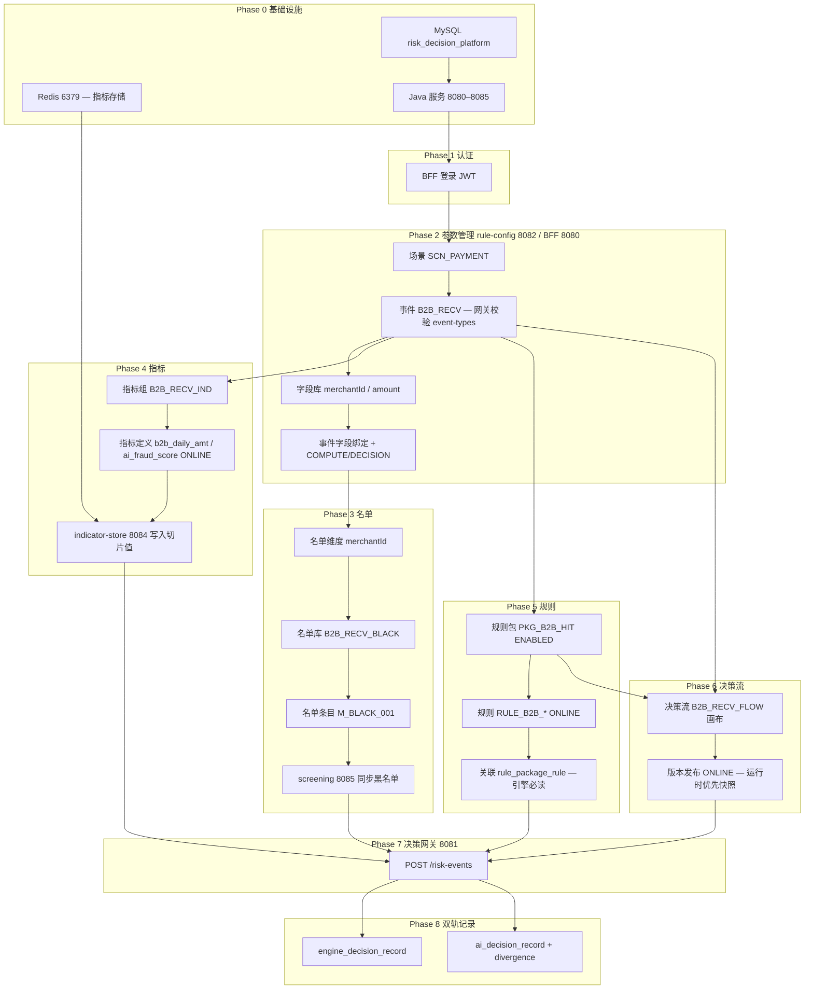

# B2B_RECV 事中复杂场景 — 按依赖顺序的测试流程

## 一、模块依赖关系（必须先造什么、后造什么）



**关键依赖说明**

| 若跳过 | 下游现象 | 是否代码 Bug |
|--------|----------|--------------|
| 未创建 `B2B_RECV` 或未 ENABLED | 网关 **404** `event-types` 查不到 | 造数问题；seed 须校验 `GET 8082/event-types` |
| 未绑定事件字段 | 规则表达式 `amount` 无值，规则不命中 | 造数问题 |
| 未 `POST rule-packages/{id}/rules` | 引擎读 `rule_package_rule` 为空，永远 PASS | 造数问题（非仅 `rulePackageId`） |
| 规则包 `status=DISABLED` | 引擎降级，无命中 | 造数问题 |
| 决策流未发布 ONLINE | 用 DRAFT 定义，行为可能不一致 | 造数/发布流程 |
| indicator-store 不可用 | 指标规则 T07/T08 失败；health 可能 503 | 环境（Redis） |
| BFF 无 `POST decision-flows/**` | 发布版本 404/无路由 | **已修**：`RuleConfigProxyController` |
| Token 过期中途 401 | seed 半成品、规则/指标组创建失败 | 脚本须分段 `Login` |

---

## 二、推荐执行顺序（手工 / 脚本）

### Phase 0 — 环境与清库

1. 确认端口：`8080` BFF、`8081` Gateway、`8082` rule-config、`8083` engine、`8084` indicator-store、`8085` screening 均为 **UP**。
2. `indicator-store` 依赖 **Redis**；未启动时写入指标可能失败，actuator health 常为 503。
3. 清库（仅 TRUNCATE + Flyway 种子，**不写业务 INSERT**）：

```powershell
cd risk-decision-platform\scripts
.\clear-all-data.ps1
```

4. 清库后 Flyway 仅恢复 **5 个演示事件**（`EVT_PAY_*` 等），**不含 `B2B_RECV`**，必须跑 seed。

### Phase 1 — 认证（T00）

| 操作 | API |
|------|-----|
| 登录 | `POST /bff/api/v1/auth/login` `admin` / `admin123` |

后续所有 BFF **POST/PUT** 需 `OPERATOR`/`ADMIN` 角色。

### Phase 2 — 参数管理（造数第一步）

| 顺序 | 操作 | API（BFF 8080） | 验证 |
|------|------|-----------------|------|
| 2.1 | 场景树 | `GET /scenarios/tree` | 存在 `SCN_PAYMENT` |
| 2.2 | **创建事件** | `POST /events` code=`B2B_RECV` | `GET /events` 含该 code |
| 2.3 | **网关可见** | `GET http://8082/api/v1/event-types` | **必须**含 `B2B_RECV` + `ENABLED` |
| 2.4 | 字段库 | `POST /fields` merchantId, amount | |
| 2.5 | 事件字段 | `POST /events/B2B_RECV/fields` | purposes=COMPUTE,DECISION |

### Phase 3 — 名单

| 顺序 | API | 说明 |
|------|-----|------|
| 3.1 | BFF `POST /list-dimensions` | merchantId |
| 3.2 | BFF `POST /list-libraries` | B2B_RECV_BLACK |
| 3.3 | BFF `POST /list-entries` | M_BLACK_001 |
| 3.4 | screening `POST /lists` | 网关 LIST_CHECK 节点用 |

**用例前置**：T03 黑名单 → `M_BLACK_001`。

### Phase 4 — 指标

| 顺序 | API | 说明 |
|------|-----|------|
| 4.1 | BFF `POST /indicator-groups` | 绑定 B2B_RECV |
| 4.2 | BFF `POST /indicator-definitions` | b2b_daily_amt, ai_fraud_score |
| 4.3 | BFF `PUT /indicator-definitions/{id}/online` | 必须 ONLINE |
| 4.4 | `POST 8084/indicators/{refName}` | 测试时写入维度值 |

**用例前置**：T07 写 `b2b_daily_amt=160000`；T08 写 `ai_fraud_score=0.92`。

### Phase 5 — 规则（注意关联表）

| 顺序 | API | 说明 |
|------|-----|------|
| 5.1 | BFF `POST /rule-packages` | PKG_B2B_HIT, eventTypeCodes=[B2B_RECV] |
| 5.2 | BFF `POST /rules-v2` | 三条规则 + `PUT .../status` ONLINE |
| 5.3 | **BFF `POST /rule-packages/{pkgId}/rules`** | `ruleV2Id` + `priority` — **引擎执行依赖** |
| 5.4 | BFF `PUT /rule-packages/{id}/status?enabled=true` | 包必须 ENABLED |

### Phase 6 — 决策流

| 顺序 | API | 说明 |
|------|-----|------|
| 6.1 | BFF `POST /decision-flows` | B2B_RECV_FLOW |
| 6.2 | BFF `PUT /decision-flows/{id}` | START→LIST_CHECK→RULE_PACKAGE→GATEWAY→END×3 |
| 6.3 | BFF `POST /decision-flows/{id}/versions/{v}:online` | 发布 ONLINE（需重启 BFF 加载新路由） |

画布逻辑：`lastDecision==REJECT→AUTO_REJECT`，`REVIEW→MANUAL_REVIEW`，默认 `AUTO_PASS`；网关对外归一化为 REJECT/REVIEW/PASS。

### Phase 7 — 网关决策（T02–T09）

`POST http://8081/api/v1/risk-events`

```json
{ "eventTypeCode": "B2B_RECV", "context": { "merchantId": "M_OK_001", "amount": 5000 } }
```

| ID | 场景 | 预期 decision |
|----|------|---------------|
| T02 | 正常小额 | PASS |
| T03 | M_BLACK_001 | REJECT（名单覆盖引擎 PASS） |
| T04 | amount 200000 | REJECT（大额规则+网关） |
| T07 | 日累计 160k + 小额 | REVIEW |
| T08 | ai_fraud 0.92 | REVIEW |
| T09 | 日累计 + 大额同笔 | REJECT（取严） |

### Phase 8 — 双轨记录（T02–T05）

| 检查 | API |
|------|-----|
| 引擎记录 | `GET /bff/api/v1/engine-decision-records/{eventId}` |
| AI 记录 | `GET /bff/api/v1/ai-decision-records/{eventId}` |
| 关联 | `correlationId` 跨表一致；T03/T04 divergence=true |

### Phase 9 — UI（可选）

- `/engine-decision-records`、`/ai-decision-records`
- 决策流画布、规则包、指标定义列表
- 中文乱码 `???`：重新 `clear-all-data.ps1`（UTF-8 修复后）

---

## 三、一键脚本（推荐）

```powershell
cd risk-decision-platform\scripts
$env:JAVA_HOME = "C:\Users\12559\.jdks\corretto-18.0.2"   # 如需重启 Java 服务

.\clear-all-data.ps1          # Phase 0
.\seed-b2b-recv-demo.ps1      # Phase 2–6 造数
.\run-e2e-test-plan.ps1       # Phase 7–8 用例
```

`run-e2e-test-plan.ps1` 内含 seed；若已 seed 可只跑用例部分（脚本会再跑 seed 做幂等）。

**修改 BFF 路由后**须重启 `admin-bff`（8080）再发布决策流 ONLINE。

---

## 四、报错速查（环境 vs Bug）

| 现象 | 先查什么 | 结论 |
|------|----------|------|
| 网关 404 risk-events | `GET 8082/event-types` 是否有 B2B_RECV | 造数未完成 |
| BFF 401 | Token / 角色；seed 中段重新 Login | 脚本或会话 |
| 规则永不命中 | `GET rule-packages/{id}/rules` 是否有关联 | 缺 `rule_package_rule` |
| T07/T08 非 REVIEW | 8084 指标写入是否成功；规则是否 ONLINE | 环境或造数 |
| 发布流版本 401 | 8082 POST 需 JWT；或走 BFF | 用 BFF + 重启 |
| 发布流版本 404 | BFF 缺 `POST decision-flows/**` | **代码 Bug（已修）** |
| UI 场景名 ??? | 清库脚本编码 | 重跑 clear-all-data |
| engine final 与对外 decision 不一致 | 名单合并逻辑 | 设计行为（T03） |

---

## 五、复杂事中场景造数要点

### 规则包 `PKG_B2B_HIT`（HIT）

| 规则 | 条件 | 风险等级 | 命中决策 |
|------|------|----------|----------|
| RULE_B2B_BIGAMT | amount > 100000 | HIGH | REJECT |
| RULE_B2B_DAILY_IND | b2b_daily_amt > 150000 | MEDIUM | REVIEW |
| RULE_B2B_AI_FRAUD | ai_fraud_score > 0.8 | MEDIUM | REVIEW |

### 决策流 `B2B_RECV_FLOW`

```
START → LIST_CHECK → RULE_PACKAGE → CONDITION_GATEWAY
  ├─ lastDecision == REJECT  → END(AUTO_REJECT)
  ├─ lastDecision == REVIEW  → END(MANUAL_REVIEW)
  └─ default                 → END(AUTO_PASS)
```
