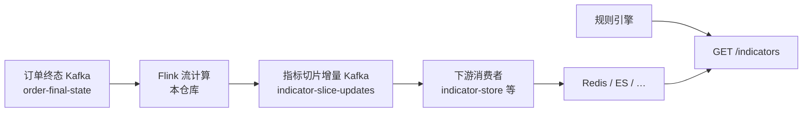

# risk-decision-data-engine

**风控实时决策平台 · 数据引擎**

本仓库是风控实时决策平台的 **数据引擎** 层：承载旁路侧的高吞吐、有状态计算，与事中 **决策引擎**（`rule-decision-engine`，位于 [risk-decision-services](https://github.com/snhwade/risk-decision-services)）分工协作。

| 引擎 | 职责 | 延迟 |
|------|------|------|
| **决策引擎** | 规则匹配、Aviator 执行、决策聚合 | 毫秒级（同步返回） |
| **数据引擎**（本仓库） | 指标累计、同步、回填等旁路计算 | 秒级（异步旁路） |

> 与在线微服务解耦，不阻塞实时决策链路。

## 架构设计

### 指标累计链路（默认）

Flink **只负责计算**，结果回写 Kafka；存储写入由下游消费者（如 indicator-store-service）完成，便于 **多路监听、写入不同存储**。



| 阶段 | 组件 | 说明 |
|------|------|------|
| 输入 | `order-final-state` | 业务系统推送订单终态 JSON |
| 计算 | `IndicatorAccumulationJob` | 路由、幂等、Aviator 累计脚本 |
| 输出 | `indicator-slice-updates` | `IndicatorSliceUpdate` 增量事件 |
| 落库 | indicator-store-service | 按配置写 Redis / ES（可部署多实例不同 group） |

> 完整说明（消息契约、多路消费、降级模式）：见 [risk-decision-services/docs/architecture-indicator-pipeline.md](https://github.com/snhwade/risk-decision-services/blob/main/docs/architecture-indicator-pipeline.md)（monorepo 同源文档）。

## 仓库定位

| 项 | 说明 |
|---|---|
| 职责 | 旁路数据采集、转换、累计、**输出 Kafka 事件** |
| 运行形态 | 独立 Flink Job，可水平扩展 |
| 与决策链路 | 旁路计算；决策引擎通过 indicator-store 读取结果 |
| 演进方向 | 新的旁路计算能力优先在本仓库新增模块/作业 |

## 当前能力

### 指标流累计（`indicator-accumulation`）

| 项 | 说明 |
|---|---|
| 主类 | `com.riskplatform.flink.IndicatorAccumulationJob` |
| 运行时 | Apache Flink 1.20 |
| 输入 | Kafka `order-final-state` |
| 输出 | Kafka `indicator-slice-updates`（**不再直连 Redis**） |

**Flink 拓扑：**

```
order-final-state
  → 反序列化 OrderFinalState
  → 动态路由指标定义（轮询 rule-config-service）
  → keyBy(refName | dimensionKey)
  → IndicatorAccumulateEmitFunction（orderId 幂等 + Aviator 增量）
  → indicator-slice-updates
```

**核心能力**：时间窗口切片、Aviator 累计脚本、维度 keyBy、orderId 幂等去重、Checkpoint。

## 技术栈

- **Apache Flink 1.20** — 流计算
- Flink Kafka Connector、Aviator、Jackson
- **commons-core** — `IndicatorSliceUpdate` 事件契约

## 前置依赖

| 组件 | 说明 |
|------|------|
| Kafka | `localhost:9092` |
| rule-config-service | `http://localhost:8082`（ONLINE 指标定义） |
| indicator-store-service | 消费 `indicator-slice-updates` 并落库（见 services 仓库） |

## 构建

```powershell
git clone https://github.com/snhwade/risk-decision-data-engine.git
cd risk-decision-data-engine
mvn clean package -DskipTests -pl indicator-accumulation
```

产物：`indicator-accumulation/target/indicator-accumulation-1.0.0-SNAPSHOT-shaded.jar`

## 运行

```powershell
java -jar indicator-accumulation/target/indicator-accumulation-1.0.0-SNAPSHOT-shaded.jar `
  --kafka localhost:9092 `
  --sink-topic indicator-slice-updates `
  --rule-config http://localhost:8082
```

提交到 Flink 集群：

```bash
flink run -c com.riskplatform.flink.IndicatorAccumulationJob \
  indicator-accumulation/target/indicator-accumulation-1.0.0-SNAPSHOT-shaded.jar \
  --kafka kafka:9092 \
  --sink-topic indicator-slice-updates \
  --rule-config http://rule-config:8082
```

## 目录结构

```
risk-decision-data-engine/
├── pom.xml
├── indicator-accumulation/
│   ├── README.md
│   └── src/main/java/com/riskplatform/flink/
│       ├── IndicatorAccumulationJob.java
│       ├── operator/IndicatorAccumulateEmitFunction.java
│       └── ...
```

## 与 indicator-store 的关系

| 模式 | 说明 |
|------|------|
| `flink`（**默认**） | 本仓库 Flink → Kafka → indicator-store 消费落库 |
| `service`（降级） | 无 Flink；store 直接消费 `order-final-state` |

## 关联仓库

| 仓库 | 说明 |
|------|------|
| [risk-decision-services](https://github.com/snhwade/risk-decision-services) | Java 微服务（indicator-store 消费切片增量） |
| [risk-decision-commons](https://github.com/snhwade/risk-decision-commons) | 公共库（`IndicatorSliceUpdate`） |
| [risk-decision-admin-console](https://github.com/snhwade/risk-decision-admin-console) | 管理控制台 |
| [risk-decision-ai-training](https://github.com/snhwade/risk-decision-ai-training) | AI 旁路增强 |

## 监控建议

- Flink Web UI：背压、Checkpoint
- Kafka：`order-final-state` / `indicator-slice-updates` consumer lag
- 下游 Redis / ES：由 indicator-store 侧观测
